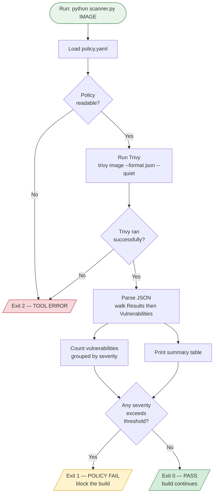
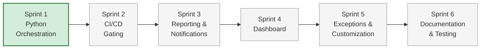

# Container Image Vulnerability Scanner

A **shift-left security** tool that scans container images for known vulnerabilities and gates the build pipeline before insecure images ever reach production. Built by orchestrating around [Trivy](https://github.com/aquasecurity/trivy) rather than reinventing a scanner — fast to build, cheap to run, and aligned with how real CI/CD security works.

> **Shift-left** means catching security problems as early as possible — at the developer's commit, not after deployment. The earlier a vulnerability is caught, the cheaper it is to fix.

---

## Table of Contents

- [Why This Project](#why-this-project)
- [Key Concepts](#key-concepts)
- [System Architecture](#system-architecture)
- [Scan & Gate Flow](#scan--gate-flow)
- [Technology Stack](#technology-stack)
- [Getting Started](#getting-started)
- [Usage](#usage)
- [Exit Codes](#exit-codes)
- [Tuning the Policy Gate](#tuning-the-policy-gate)
- [How It Works](#how-it-works)
- [Roadmap](#roadmap)
- [Project Structure](#project-structure)

---

## Why This Project

Container images are built from many layers, each potentially carrying outdated packages with published CVEs (Common Vulnerabilities and Exposures). Shipping these to production exposes the whole system. This scanner:

- **Detects** known vulnerabilities in any container image.
- **Decides** pass or fail against a tunable policy.
- **Blocks** the pipeline automatically when an image is too risky.
- **Reports** results so humans and dashboards can act.

Two principles drive the design:

- **Wrap, don't rebuild.** Trivy is the proven scanning engine. The value is in the orchestration layer around it — running it, interpreting it, and enforcing policy.
- **Vertical slice first.** Get one thin end-to-end path working (push → scan → gate) before expanding to reporting, dashboards, and exceptions.

---

## Key Concepts

| Term | Meaning |
|------|---------|
| **Policy Gate** | The pass/fail rule. Counts vulnerabilities by severity and compares against configured limits. |
| **Tool failure vs. policy failure** | A *crash* (couldn't scan) is treated completely differently from a *block* (scan worked, too many vulns). They must never be confused. |
| **Severity threshold** | The maximum tolerated count per severity level (e.g. `CRITICAL: 0`, `HIGH: 10`). Exceeding it fails the build. |
| **Exit code contract** | The numeric signal the script returns so CI/CD knows what happened without parsing text. |

---

## System Architecture

How the components connect — from a developer's commit, through the Sprint 1 orchestration layer, to the three possible outcomes. The dashed box holds components planned for later sprints.


The developer pushes code, an image is built, and `scanner.py` takes over: it reads thresholds from `policy.yaml`, runs Trivy against the image, and feeds the results into the policy gate. The gate produces exactly one of three exit codes — pass, policy fail, or tool error — which is what CI/CD acts on in the next sprint.

---

## Scan & Gate Flow

The runtime sequence of a single scan — the four jobs `scanner.py` performs, and how each outcome maps to an exit code.



The split between exit `1` and exit `2` is deliberate: a **broken scanner must never look like a passing build**, and a **vulnerability block must never look like a crash**.

---

## Technology Stack

| Layer | Tool | Status |
|-------|------|--------|
| Scanning engine | **Trivy** | Sprint 1 ✅ |
| Orchestration | **Python 3.11+** | Sprint 1 ✅ |
| Policy config | **YAML** (PyYAML) | Sprint 1 ✅ |
| CI/CD gating | **GitHub Actions** → **Jenkins** | Later |
| Notifications | **Slack webhooks** | Later |
| Reporting | **Jinja2 + WeasyPrint** | Later |
| Metrics & dashboard | **Prometheus Pushgateway + Grafana** | Later |
| Storage | **SQLite → PostgreSQL** | Later |
| Environment | **WSL2 + Docker Desktop** | Setup ✅ |

---

## Getting Started

### Prerequisites

The full environment setup (WSL2, Docker, Python, Trivy, Git) is covered in the separate setup guide. In short, you need Trivy installed and Docker running.

### Install dependencies

From inside the project folder, with your virtual environment active (your prompt should show `(.venv)`):

```bash
pip install pyyaml
```

That's the only dependency. Everything else is the Python standard library plus Trivy itself.

---

## Usage

Run a scan against an image:

```bash
python scanner.py python:3.9-slim
```

Use a specific policy file:

```bash
python scanner.py python:3.9-slim --policy policy.yaml
```

> `python:3.9-slim` is a deliberately older, vulnerable image — useful for confirming the gate actually fails on its first run.

Check the exit code after a run:

```bash
python scanner.py python:3.9-slim
echo "exit code: $?"
```

---

## Exit Codes

| Code | Meaning | When |
|------|---------|------|
| `0` | **PASS** | Scan ran, policy satisfied |
| `1` | **POLICY FAIL** | Scan ran, too many vulnerabilities — block the build |
| `2` | **TOOL ERROR** | Couldn't scan or couldn't read the policy — alert someone |

CI/CD reads this code to decide whether to continue, block, or raise an alert.

---

## Tuning the Policy Gate

The gate lives in `policy.yaml`:

```yaml
thresholds:
  CRITICAL: 0
  HIGH: 10
```

A severity **fails the build when its count exceeds the limit.** So with `HIGH: 10`, a scan finding exactly 10 HIGHs still passes; 11 fails. `CRITICAL: 0` means any critical fails — zero tolerance.

### Temporarily raising a limit

When an app has more HIGHs than allowed and the upstream fix isn't released yet, raise the number to unblock the build — and document why:

```yaml
thresholds:
  CRITICAL: 0
  HIGH: 20   # raised from 10 for app-x, pending upstream patch;
             # set a review date and tighten again once fixed
```

Then commit with a clear message so Git history becomes your audit trail:

```bash
git add policy.yaml
git commit -m "Raise HIGH gate to 20 for app-x pending upstream patch"
```

> A proper per-CVE exception mechanism **with automatic expiry** arrives in a later sprint. This manual, dated approach is the Sprint 1 stand-in — and the expiry discipline (always set a review date) carries forward.

---

## How It Works

`scanner.py` performs four jobs in order:

1. **Run Trivy** — calls `trivy image --format json --quiet <image>` and captures the JSON from stdout. Trivy's own `--exit-code` is deliberately *not* used, so a non-zero exit from Trivy unambiguously means the tool failed, not that vulnerabilities were found.
2. **Parse** — walks `Results[].Vulnerabilities[]`, tolerating clean layers that have no vulnerabilities key.
3. **Apply gate** — counts vulnerabilities by severity and compares each to its threshold.
4. **Report** — prints the summary table and returns the exit code.

---

## Roadmap

The project is built in six sprints (~20 hours each), each adding one capability to the working vertical slice.



| Sprint | Focus | Adds |
|--------|-------|------|
| **1** | Orchestration layer | Run Trivy, parse, enforce pass/fail gate ✅ |
| **2** | CI/CD gating | Wire the gate into GitHub Actions (later Jenkins) |
| **3** | Reporting & notifications | PDF/HTML reports (Jinja2 + WeasyPrint), Slack alerts |
| **4** | Dashboard | Push metrics to Prometheus, visualize in Grafana |
| **5** | Exceptions & customization | Per-CVE exceptions with automatic expiry |
| **6** | Documentation & testing | Hardening, test coverage, final docs |

---

## Project Structure

```
vuln-scanner/
├── scanner.py        # The wrapper: run Trivy, parse, gate, report
├── policy.yaml       # Tunable gate thresholds
├── README.md         # This file
├── docs/
│   └── architecture.svg   # System architecture diagram
├── .gitignore        # Ignores .venv/ and result.json
└── .venv/            # Virtual environment (not committed)
```

---

*Built as a solo academic project demonstrating shift-left container security with cost-conscious tooling.*
